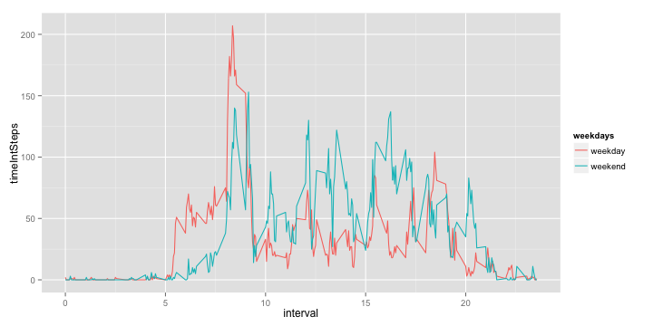

# Reproducible Research: Peer Assessment 1

### Loading and preprocessing the data

Unzipping and loading data. 

```r
unzip("activity.zip")
activity <- read.csv(file="activity.csv")
```

Transforming the date into POSIXlt format.
Time interval is converted to `h.mm` from `hmm` to better reflect the hour for time series plots.


```r
activity$date <- strptime(activity$date, format="%Y-%m-%d")
activity$interval <- activity$interval/100
```

### What is mean total number of steps taken per day?

Computing a summary for histogram of the total number of steps taken each day.


```r
library(plyr)
StepsSummary <- ddply(activity, .(date), summarize, 
      sumSteps = sum(steps))

hist(StepsSummary$sumSteps, col = "grey", breaks = 20, 
     main = "Histogram of Number of Steps", 
     xlab = "Number of steps per day", ylab = "Frequency (days)")
```

 


```r
Mean = round(mean(StepsSummary$sumSteps, na.rm = TRUE), 0)
Median = median(StepsSummary$sumSteps, na.rm = TRUE)
MeanDisplay = as.character(Mean)
```

For the total number of steps taken each day, the mean is **10766** and the median is **10765**.

### What is the average daily activity pattern?

Making a time series plot to examine the daily activity pattern. 


```r
require(plyr)
StepsTimeInt <- ddply(activity, .(interval), summarize, 
      timeIntSteps = round(mean(steps, na.rm = TRUE), 0))

max_y1 <- ceiling(max(StepsTimeInt$timeIntSteps))
plot(StepsTimeInt$interval, StepsTimeInt$timeIntSteps, 
    type = "l", ylim = c(0, max_y1), axes=FALSE, ann=FALSE)
axis(1, at=2*0:24)
axis(2, las=1, at=50*0:max_y1)
title(xlab = "Time of day (24-hour)", ylab = "Number of steps",
    main = "Daily Activity Pattern \nAveraged Across All Days")
```

 

```r
maxRow <- which.max(StepsTimeInt$timeIntSteps)
tInt <- (StepsTimeInt$interval[maxRow])*100
```

Of the 5-minute intervals, on average across all the days in the dataset, the interval **835** (8:35am) had the maximum number of steps.


### Imputing missing values

Calculating the number of missing values.


```r
NAvalues = sum(colSums(is.na(activity)))
```

Total number of missing values in the dataset is **2304**.

Imputing missing values `NA` to avoid introducing bias into calculations or summaries of the data. Filling in all of the missing values in the dataset based on the the mean for that 5-minute interval.
Steps are as follows:
- Creating an index of missing values
- Creating a vector of step means that correspons to each given interval for each day --  using previous calculation of step means
- Inserting values for missing observations, while populating remaining rows with NAs
- Replacing all NAs with 0 and summing up steps and average steps columns to create a column with both original data and imputed values.


```r
NAindex <- !complete.cases(activity$steps)

stepsMean = StepsTimeInt$timeIntSteps[which(StepsTimeInt$interval == activity$interval)]
activity$stepsMean[NAindex] <- stepsMean[NAindex]
activity[is.na(activity)] <- 0
activity$stepsNoNAs <- activity$steps + activity$stepsMean
```

Creating a new dataset with the imputed values filled in.


```r
activityImputed <- subset(activity, select = c(stepsNoNAs, date, interval))
```

Making a histogram of the total number of steps taken each day.


```r
StepsSummaryImputed <- ddply(activityImputed, .(date), summarize, 
      sumSteps = sum(stepsNoNAs))

hist(StepsSummaryImputed$sumSteps, col = "grey", breaks = 20, 
     main = "Histogram of Number of Steps \nWith Imputed Missing Values", 
     xlab = "Number of steps per day", ylab = "Frequency (days)")
```

 

The two histograms reflect very similar distributions with one notable exception -- the imputed values increase the number of days with least activity (near 0 number of steps) to levels near the peak of the distribution. The peak of the distribution is also slightly higher in the dataset with imputed values.

Calculating the mean and median total number of steps taken per day for the dataset with imputed values. 


```r
MeanImputed = round(mean(StepsSummaryImputed$sumSteps), 0)
MedianImputed = median(StepsSummaryImputed$sumSteps)
MeanImputedDisplay = as.character(MeanImputed)
```

Mean and median values are lower with imputed values. The difference between the mean and the median increases as well which would also represent avereages of a more skewed distribution. The new values are **9531** for the mean and **1.0439 &times; 10<sup>4</sup>** for the median. (The original dataset had a mean of **10766** and the median of **10765**).

### Are there differences in activity patterns between weekdays and weekends?

Creating another column with a weekday label using weekeays() function. Adjusting the levels to only include "weekday" and "weekend".


```r
activityImputed$weekdays <- as.factor(weekdays(activityImputed$date))
labelWeekdays = c("weekday", "weekday", "weekend", "weekend", "weekday", "weekday", "weekday")
levels(activityImputed$weekdays) = as.factor(labelWeekdays)
```

Creating a panel plot for the time series with the 5-minute interval as x-axis and the average number of steps taken, averaged across all weekday days or weekend days as y-axis. The plot illustrates differences in activity between weekend and weekdays.


```r
require(plyr)
StepsTimeImputed <- ddply(activityImputed, .(interval, weekdays), summarize, 
      timeIntSteps = round(mean(stepsNoNAs),0))

StepsTimeImputedWeekdays <- subset(StepsTimeImputed, weekdays == "weekday")
StepsTimeImputedWeekends <- subset(StepsTimeImputed, weekdays == "weekend")

max_y2 <- ceiling(max(StepsTimeImputed$timeIntSteps))

plot(StepsTimeImputedWeekdays$interval, StepsTimeImputedWeekdays$timeIntSteps, 
    type = "l", ylim = c(0, max_y2), axes=FALSE, ann=FALSE)
axis(1, at=2*0:24)
axis(2, las=1, at=50*0:max_y2)
title(xlab = "Time of day (24-hour)", ylab = "Number of steps",
    main = "Daily Activity Pattern \nAveraged Across All Weekdays")
```

 

```r
plot(StepsTimeImputedWeekends$interval, StepsTimeImputedWeekends$timeIntSteps, 
    type = "l", ylim = c(0, max_y2), axes=FALSE, ann=FALSE)
axis(1, at=2*0:24)
axis(2, las=1, at=50*0:max_y2)
title(xlab = "Time of day (24-hour)", ylab = "Number of steps",
    main = "Daily Activity Pattern \nAveraged Across All Weekends")
```

 

Plotting weekday and weekend activity together makes it easier to compare.

```r
library("ggplot2")
ggplot(StepsTimeImputed, aes(group = factor(weekdays), x = interval, 
      y = timeIntSteps, color = weekdays)) + geom_line() 
```

 
