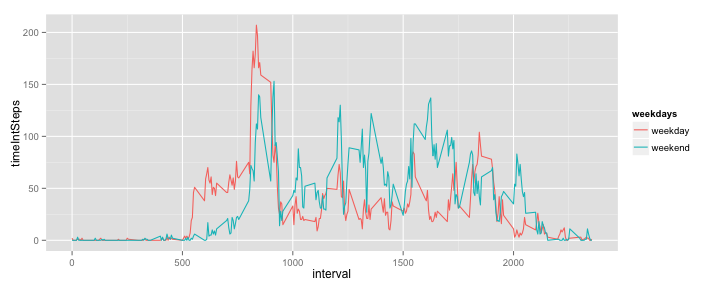

# Reproducible Research: Peer Assessment 1

### Loading and preprocessing the data

Unzipping and loading data. 

```r
unzip("activity.zip")
activity <- read.csv(file="activity.csv")
```

Transforming the date into POSIXlt date format.


```r
activity$date <- strptime(activity$date, format="%Y-%m-%d")
```

### What is mean total number of steps taken per day?

Computing a histogram of the total number of steps taken each day.


```r
require(plyr)
```

```
## Loading required package: plyr
```

```r
StepsSummary <- ddply(activity, .(date), summarize, 
      meanSteps = mean(steps), 
      medianSteps = median(steps, na.rm = TRUE), 
      sumSteps = sum(steps))

hist(StepsSummary$sumSteps, col = "grey", main = c("Histogram of Number of Steps"), 
xlab = c("Number of Steps Taken per Day"))
```

 

```r
#tapply(x, list(group[row(x)], col(x)), sum)
#t(sapply(split(as.data.frame(x), group), colSums))
#aggregate(x, list(group), sum)[-1]
```


```r
Mean = round(mean(StepsSummary$sumSteps, na.rm = TRUE), 0)
Median = median(StepsSummary$sumSteps, na.rm = TRUE)
```
For the total number of steps taken each day, the mean is **1.0766 &times; 10<sup>4</sup>** and the median is **10765**.

### What is the average daily activity pattern?

1. Make a time series plot (i.e. `type = "l"`) of the 5-minute interval (x-axis) and the average number of steps taken, averaged across all days (y-axis)


```r
require(plyr)
StepsTimeInt <- ddply(activity, .(interval), summarize, 
      timeIntSteps = round(mean(steps, na.rm = TRUE), 0))

maxRow <- which.max(StepsTimeInt$timeIntSteps)
tInt <- StepsTimeInt$interval[maxRow]
```

Of the 5-minute intervals, on average across all the days in the dataset, the interval **835** had the maximum number of steps.


### Imputing missing values

Note that there are a number of days/intervals where there are missing
values (coded as `NA`). The presence of missing days may introduce
bias into some calculations or summaries of the data.


```r
NAvalues = sum(colSums(is.na(activity)))
```

Total number of missing values in the dataset is **2304**.


2. Devise a strategy for filling in all of the missing values in the dataset. The strategy does not need to be sophisticated. For example, you could use the mean/median for that day, or the mean for that 5-minute interval, etc.

Creating an index of missing values; 
Using previous calculation of steps mean for every given interval, inserting values for missing observations, while populating remaining rows with NAs 
Replacing all NAs with 0 and summing them up to get new imputed values


```r
activity <- read.csv(file="activity.csv")
activity$date <- strptime(activity$date, format="%Y-%m-%d")
StepsTimeInt <- ddply(activity, .(interval), summarize, 
      timeIntSteps = round(mean(steps, na.rm = TRUE), 0))

NAindex <- !complete.cases(activity$steps)

stepsMean = StepsTimeInt$timeIntSteps[which(StepsTimeInt$interval == activity$interval)]
activity$stepsMean[NAindex] <- stepsMean[NAindex]
activity[is.na(activity)] <- 0
activity$stepsNoNAs <- activity$steps + activity$stepsMean
```

3. Create a new dataset that is equal to the original dataset but with the missing data filled in.

```r
activityImputed <- subset(activity, select = c(stepsNoNAs, date, interval))
```

4. Make a histogram of the total number of steps taken each day and Calculate and report the **mean** and **median** total number of steps taken per day. Do these values differ from the estimates from the first part of the assignment? What is the impact of imputing missing data on the estimates of the total daily number of steps?

```r
StepsSummaryImputed <- ddply(activityImputed, .(date), summarize, 
      sumSteps = sum(stepsNoNAs))

hist(StepsSummaryImputed$sumSteps, col = "grey", main = c("Histogram of Number of Steps With Imputed Missing Values"), 
xlab = c("Number of Steps Taken per Day"))
```

 


```r
MeanImputed = round(mean(StepsSummaryImputed$sumSteps, na.rm = TRUE), 0)
MedianImputed = median(StepsSummaryImputed$sumSteps, na.rm = TRUE)
```

Mean and median values are lower with imputed values -- since the distribution has a right-skew, imputed values on average are smaller. The difference between the Mean and the Median increases.

### Are there differences in activity patterns between weekdays and weekends?

For this part the `weekdays()` function may be of some help here. Use
the dataset with the filled-in missing values for this part.


```r
activityImputed$weekdays <- as.factor(weekdays(activityImputed$date))
labelWeekdays = c("weekday", "weekday", "weekend", "weekend", "weekday", "weekday", "weekday")
levels(activityImputed$weekdays) = as.factor(labelWeekdays)

StepsTimeImputed <- ddply(activityImputed, .(interval, weekdays), summarize, 
      timeIntSteps = round(mean(stepsNoNAs),0))

library("ggplot2")
ggplot(StepsTimeImputed, aes(group = factor(weekdays), x = interval, y = timeIntSteps, color = weekdays)) + geom_line() 
```

 

http://stackoverflow.com/questions/18827532/relevel-a-factor

1. Create a new factor variable in the dataset with two levels -- "weekday" and "weekend" indicating whether a given date is a weekday or weekend day.

1. Make a panel plot containing a time series plot (i.e. `type = "l"`) of the 5-minute interval (x-axis) and the average number of steps taken, averaged across all weekday days or weekend days (y-axis). The plot should look something like the following, which was creating using **simulated data**:

 


**Your plot will look different from the one above** because you will
be using the activity monitor data. Note that the above plot was made
using the lattice system but you can make the same version of the plot
using any plotting system you choose.


## Submitting the Assignment

To submit the assignment:

1. Commit the your completed `PA1_template.Rmd` file to the `master` branch of your git repository (you should already be on the `master` branch unless you created new ones)

2. Commit your `PA1_template.md` and `PA1_template.html` files produced by processing your R markdown file with `knit2html()` function in R (from the **knitr** package)

3. If your document has figures included (it should) then they should have been placed in the `figures/` directory by default (unless you overrided the default). Add and commit the `figures/` directory to yoru git repository.

4. Push your `master` branch to GitHub.

5. Submit the URL to your GitHub repository for this assignment on the course web site.

In addition to submitting the URL for your GitHub repository, you will
need to submit the 40 character SHA-1 hash (as string of numbers from
0-9 and letters from a-f) that identifies the repository commit that
contains the version of the files you want to submit. You can do this
in GitHub by doing the following

1. Going to your GitHub repository web page for this assignment

2. Click on the "?? commits" link where ?? is the number of commits you have in the repository. For example, if you made a total of 10 commits to this repository, the link should say "10 commits".

3. You will see a list of commits that you have made to this repository. The most recent commit is at the very top. If this represents the version of the files you want to submit, then just click the "copy to clipboard" button on the right hand side that should appear when you hover over the SHA-1 hash. Paste this SHA-1 hash into the course web site when you submit your assignment. If you don`t want to use the most recent commit, then go down and find the commit you want and copy the SHA-1 hash.

A valid submission will look something like (this is just an **example**!)

r
https://github.com/rdpeng/RepData_PeerAssessment1

7c376cc5447f11537f8740af8e07d6facc3d9645
